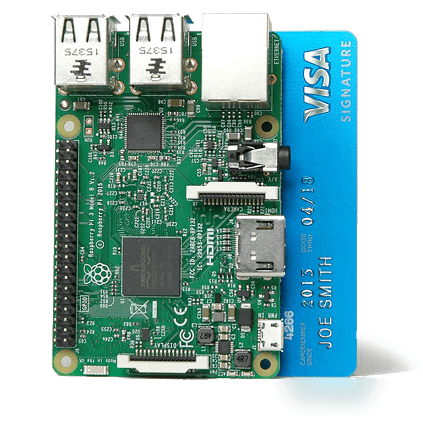
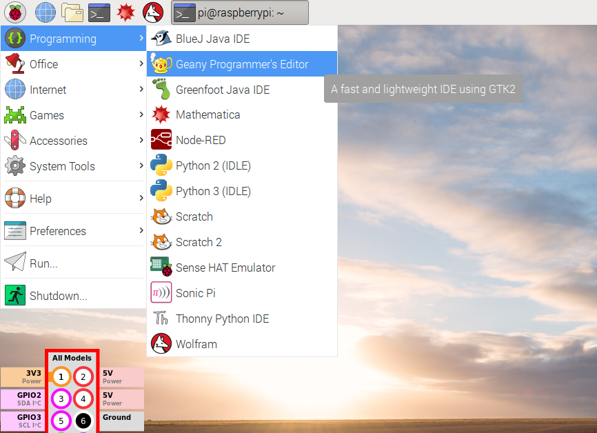
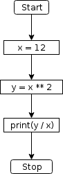
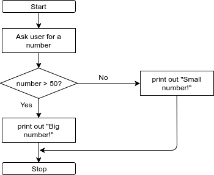
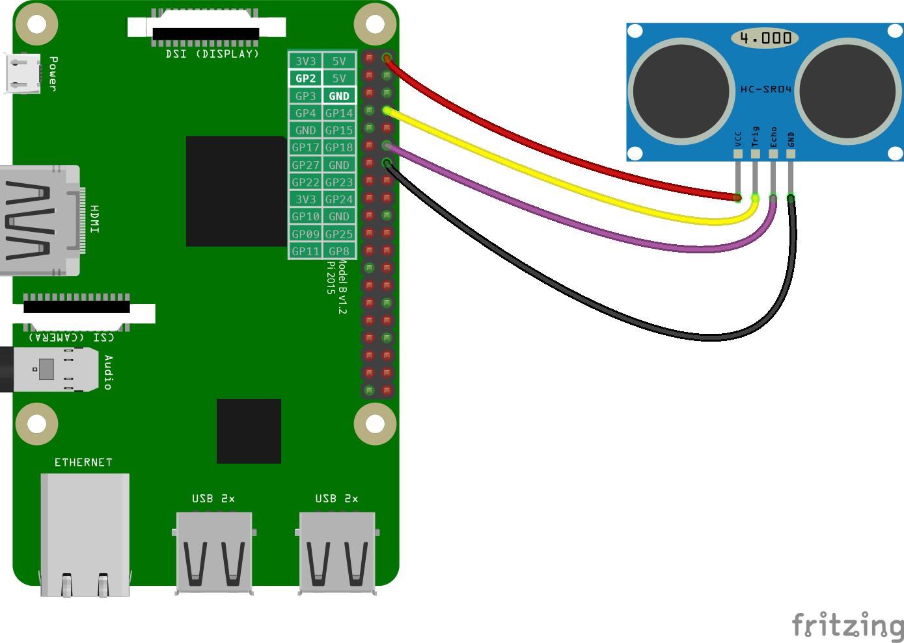
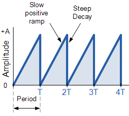

# Session 1 Workbook - Physical Computing

<p align="center">
    
</p>

# How to use this workbook

Welcome back to the Physical Computing Theme!

This session will be a workshop with lots of practical exercises that you can work through at your own pace. This is to ensure that you all gain something from this course, independent of your current Python and general programming knowledge.

We will work through this sheet as follows. For each of the following chapters, the tasks are grouped into **ascending order of difficulty**. Please attempt all tasks within the Chapter, starting with the easiest, until we reach a **Checkpoint** at which I will ask you to move on to the next Chapter.

We will also cover some basics together as a class at the beginning of each chapter.

# Homework for the next Session

If you have exercises left before wrapping up today's session, please finish them as homework for the next session. **This is mandatory.** For assessing your homework, we expect a coded solution. However, if you really get stuck with an exercise, this is not a problem, and instead of program code, we need you to explain as well as you can where and how you got stuck. It is just as useful being able to describe what the problem is as it is to solve it.

# Writing Python programs on Raspberry Pi

## The Raspberry Pi computer

Raspberry Pi is a small computer the size of a credit card that you can plug into a monitor, keyboard and mouse. You can use it in the same way as you would use your desktop PC or laptop. You can generate spreadsheets, do word processing, browse the internet, and play games. It also plays high-definition video.

However, what will make it interesting for us is its capability for use in electronics projects! The main aim of the Raspberry Pi is to teach anyone how to use programming and electronics to realise their ideas. Raspberry Pi comes with a free Linux operating system that runs from an SD card, and it is powered by a USB phone charger.

<p align="center">
    
    <figcaption align="center">The Raspberry Pi (version 3)</figcaption>
</p>

## The tools of the trade - the Linux terminal and a code editor

But how about (a) writing, and (b) executing Python programs on the Rasberry Pi?

For writing programs, we suggest using **Geany**, which is one of the pre-installed code editors on your Raspberry Pi. It has the handy feature that it highlights (i.e., colour-annotates) our programs as we write them, which helps a lot with their readability.

You find Geany in the Programming menue, as shown in the following picture.

<p align="center">
    
    <figcaption align="center">Opening the Geany script editor</figcaption>
</p>

The user interface is rather self-explanatory, with commands like CTRL+S (save), CTRL+O (open a file) etc. working as expected. It looks like shown below. Note that the program text has been coloured automatically.

<p align="center">
    
    <figcaption align="center">The Geany user interface</figcaption>
</p>

But how to actually run the program, so the computer can do what we ask it to do? That's where the Linux terminal comes in handy. Look again at the main menu bar in the Figure above. The terminal is the black symbol with <kbd>**>\_**</kbd> in it, at the top of the screen. Once you've clicked on it, the below window appears.

<p align="center">
    
    <figcaption align="center">The Linux terminal</figcaption>
</p>

We will show you how you can run a program from within the Terminal. The most important Terminal commands are listed in the table below.

| Command       | Effect     | 
| ------------- |:-------------| 
| ```ls``` | List the contents of the current folder |
| ```cd``` _folder_ | **C**hange **d**irectory into _folder_ |
| ```cd ..``` | Change into the parent folder of the current folder |
| ```cd``` | ```cd``` without argument changes back to the user's home folder (/home/pi) |
| ```pwd``` | **P**resent **w**orking **d**irectory. This prints out the location of the current folder. |
| ```python3``` _program.py_ | Run the program called _program.py_ in Python 3 |

Hint: You can use tab completion. For example, when typing ```cd```+<kbd>Tab</kbd>, the Terminal automatically lists all possible folders that are available for changing into.

Long story short - the Terminal is much like a text-based file explorer, bolted together with a powerful general "command centre" for your computer. You can also start the usual programs from within the terminal. Just type ```chromium```+<kbd>Enter</kbd>.

# Chapter 1 - Consolidating our Python skills

First off, are there any questions from the last session or the homework?

## Basic Python: Variables, Operators, Data Types

Most programming languages hold data in variables. Just like in Mathematics, variables in Python are a convenient way to refer to a quantity through a memorable name.

You can try this out in your notebook:

```Python
number_of_hands = 2 # Hold the value 2 in a variable called "number_of_hands"
fingers_per_hand = 5 # Hold the value 3 in a variable called "fingers_per_hand"
number_of_fingers = number_of_hands * fingers_per_hand # What value will this be?
```

Note that variable names must start with a letter and should only contain letters, numbers and underscores.

In this example, we used hashtags at the beginning of code lines to mark **comments**, which are not executed.

Programming languages use different **data types** for different types of data. It's horses for courses with this, and unsurprisingly Python supports text, integers, floating point and Boolean data, to name a few.

Let's try this out! In your notebook, type the following:

```python
x  = 1
some_text = "Hello World!"
some_boolean = False
print(x)
print(some_text)
print(some_boolean)
```

The first three lines assign values to three variables called `x`, `some_text`, `some_boolean`, and the last three lines use Python's built-in `print` function that prints them out. When you've typed this into a cell, press the `run cell, select below` button.

We can perform mathematical calculations in Python using the basic operators +, -, \*, /, \*\*, %. Try it out in your notebook (no need to use the print function in this case):

```python
4 + 5
4 - 3
2 * 3
3 / 4
2 ** 3
10 % 7 # Returns the remainder of a division
```

In Python, the [standard order of operations](https://en.wikibooks.org/wiki/Python_Programming/Basic_Math) is from left to right, and respects the mathematical precedence of operations (memorised by many as PEMDAS):

| Name        | Syntax     | Description  |
| ------------- |:-------------:| :-----|
| **P**arentheses     | ( ... ) | Happening before operating on anything else.|
| **E**xponents     | **  |  Exponents are evaluated before multiplication and division. |
| **M**ultiplication and **D**ivision | * / |  Multiplication is rapid addition and must happen first. |
| **A**ddition and **S**ubtraction | + -  |     |

Let's try it:

```python
3 / 4 * 5  # First division and then multiplication
3.0 / 4 * 5
(3.0 / 4) * 4
2 ** 8
10 % 7 # Remainder of a division
```

The following table lists Python's comparison operators:

| Name        | Syntax     |
| :-------------: |:-------------|
| < | Less than|
| > | Greater than|
| <=| Less than or equal to|
|>=	| Greater than or equal to|
|==	| Equal to|
|!=	| Not equal to|

You can check how these work in your notebook:

```python
2 == 3
3 == 3
2 < 3
True == (False != True)
```

The output will be

```python
False
True
True
True # Can you explain this?
```

There are more operators, which you can read about [here](https://www.tutorialspoint.com/python/python_basic_operators.htm).

## Strings, Lists and Indexing

The data stored in memory can be of different types; Python has five: **Numbers** and **Strings**, which we have encountered above, and also **List**, which we will touch upon below. (We won't have time to cover the [**Tuple**](https://www.tutorialspoint.com/python/python_tuples.htm) and [**Dictionary**](https://www.tutorialspoint.com/python/python_dictionary.htm) types.)

You can check the data types in your notebook:

```python
type(number_of_hands) # Number
type(fingers_per_hand)
type(some_text) # String
```

**Strings** in Python are a set of characters represented by the quotation marks. Python allows either a pair of single or double quotes.

**Lists** are the most versatile data types in Python. A list contains items separated by commas and enclosed in square brackets `[ ... ]`. In Python, all the items belonging to a list can be of different data type.

The values stored in a list can be accessed using the slice operator ([] and [:]) with indexes **starting at 0 at the beginning of the list**. The last point is a popular stumbling block, so beware!

The plus (+) sign is the list concatenation operator, and the asterisk (\*) is the repetition operator.

```python
list = [ 'abc', 12 , 2.23, 'john', 70.2 ]
tinylist = [123, 'john']
my_name = "John Doe"
my_job = "technician"

print(list)            # Prints complete list
print(list[0])         # Prints first element of the list
print(list[1:3])       # Prints elements starting from 2nd till 3rd
print(list[2:])        # Prints elements starting from 3rd element
print(list[-1])        # Negative indexing: Prints the last element of the list
print(tinylist * 2)    # Prints list two times
print(list + tinylist) # Prints concatenated lists

print(my_name[0])      # Strings behave very similarly to lists
print(my_name + my_job)# String concatenation
```

Finally, you can use the `len(...)` function to find the length of a list or string.

## Control flow

We have so far seen many small bits of software that fulfil one specific task at a time (like assigning a value to a variable, or accepting user input). In order to tackle more complex tasks, we need to combine many of these items into one larger computer program. Think of programs as cooking recipes: They are a sequence of statements (i.e., lines of code), to be executed by a very quick and accurate, but also adhere-to-the-letter type of cook (your Raspberry Pi).

As programmers, we set up “paths” for the program to follow. Can you tell the output of the program?

<p align="center">

</p>

## Conditional statements

Conditional statements allow the program to react to new information _whilst it is running_ ("at runtime").

We use the `if ...:`-`elif ...:`-`else:` construct for this scenario. For example --

```python
weight = input("Please input your weight in kg: ")
height = input("Please input your height in m: ")
# Need to convert strings to actual number types, using the float(...) function
bmi = float(weight) / float(height) ** 2
if bmi >=16 and bmi < 18.5:
    print("Your BMI looks a bit low (underweight).")
elif bmi >= 18.5 and bmi < 25:
    print("Your BMI is considered healthy.")
elif bmi >= 25 and bmi < 30:
    print("Your BMI looks a bit large (overweight).")
else:
    print("According to your BMI, you are severely over- or underweight.")
```

Two important points to remember:
1. **Code blocks that are executed inside an `if`/`elif`/`else` statement are indented with a tab. This is Python's way to group code into blocks.**
2. **These code blocks start after a colon and end when the indentation stops.**

## Repeating code: Loops

Often, we need an action to be repeated. One way to achieve this is to use a `while` loop:

```python
count = 0
while (count < 9):
    print 'The count is:', count
    count = count + 1
print "Goodbye!"
```

To run through a list of things, we can use a `for` loop:

```python
my_numbers = [1,2,3,4,5]
for number in my_numbers:
    print(number ** 2)
```

## Functions

Functions enable you to "recycle" blocks of related code at different places in your program.

A function is a block of organised, reusable code that is used to perform a single, related action. Functions provide better modularity for your application and a high degree of code reusing.

```python
# Import a maths library for accessing the value of pi
import numpy as np

# Function that calculates the area of a circle from its radius
def get_area(radius):
    area = np.pi * radius ** 2
    return area

radii = [1, 2, 3, 4, 5, 6]

for radius in radii:
    area = get_area(radius)
    print("The area of a circle of radius " + radius +
          " cm is " + area + " cm^2.")
print "Done."
```

Functions are _defined_ using the `def` keyword, followed by the function name, and any arguments in brackets. Functions return a value using the `return` keyword.

## User input

The following python code accepts user input and stores it in the variable `my_number`.

```python
my_number = ''
my_number = input('Please tell me a number! ')
if (my_number == '42'):
    print('Amazing. You\'re on to something!')
else:
    print('That\'s a lovely number.')
```

**Important Note:** The output of the `input()` function is always a string, even if you input `'42'`. You need to change the type of this variable to `number` first if you want to "do maths" with it later. For this, use the `int()` or `float()` function, for example by calling `my_number = int(my_number)`.

## When things don't go to plan

When your program has run down a dead end, Python does its best to help you out of it, by printing out a help message into the Terminal.

Let's consider the following program:

```python
my_number = input("Please input a number: ")
output = my_number / 2
print(output)
```

Saving it as `test.py` and executing (inside the same folder where you saved it!) `python3 test.py`, the following will happen, assuming the user inputs "25" and presses <kbd>Enter</kbd>:

```bash
pi@raspberrypi ~ $ python3 test.py
Please input a number: 25
Traceback (most recent call last):
  File "test.py", line 2, in <module>
    output = my_number / 2
TypeError: unsupported operand type(s) for /: 'str' and 'int'
```

Can someone explain what this "Traceback" is complaining about, and what we need to correct?

## Mandatory exercises

Following on from the Introductory Session and your homework, can you solve the following tasks?

1. Program the following flow chart in Python.
   <p align="center">
   	  
   </p>

1. Program the below flow chart in Python. Ask the user to input sensible answers.
   <p align="center">
 	  
   </p>

1. Write a program that produces the following output.
   ``` python
   My number is 24
   My number is 36
   My number is 48
   My number is 60
   ```
   
1. String manipulation. Check whether a word is a palindrome. _Palindromes_ are words that read the same forwards and backwards, for example _madam_ or _racecar_.


## Optional exercises

1. Can you program Eratosthenes' sieve? Additional difficulty: Create a program that gives all prime numbers between a lower and an upper number, for example to find all primes between 10,000 and 11,000? [More information here](https://en.wikipedia.org/wiki/Sieve_of_Eratosthenes)
1. Choose a library that can perform HTTP GET requests (there is one by that very name that looks promising, see below). Can you write a program that grabs the current temperature and wind speed for a user-input location -- find a suitable on-line source -- and displays it nicely in the terminal? If you're really keen and have had a peek at the next chapter, can you get it to light an led if the temperature is above 15°C?
1. You got as far as this? Ok, fair dos. Start work on an implementation of [Dijkstra's algorithm](https://en.wikipedia.org/wiki/Dijkstra%27s_algorithm). You will have to decide on a data structure to hold a graph, amongst many other considerations.

# Chapter 3 - Physical Computing and the gpiozero library

Ultimately, we want you to control a physical contraption with your Raspberry Pi. For this, we'll use the General Purpose Input/Output (GPIO) pins on the side of your Pi. Their layout is shown below. Don't worry too much about it all for now, we will show you how to connect things up. Just one thing to remember: **Never connect a 5V pin directly to any other input pin of the Raspberry Pi, or worse the Ground pin!**

<p align="center">
    
    <figcaption align="center">Raspberry Pi pin layout</figcaption>
</p>

## Working with libraries

You've seen the `import` statement in the last session, when we imported the newer `print()` function into Python2. We also used `import numpy as np` and later `np.pi` to access the value of the mathematical constant &pi;.

The whole point is to avoid "re-inventing the wheel" by using existing software inside our programs. We do this by importing **software libraries**.

Here's an example for how powerful this idea is. Imagine you want to retrieve the raw HTML content from a website. Instead of manually coding everything up from scratch, we can do the following:

```python
import requests
r = requests.get('http://example.com') # Using everyone's favourite test domain!
print(r.content)
```

A whopping 3 lines of code to traverse the network stack, perform a HTTP GET request, await a response, save it in a variable called `r` and display it!

Things contained in libraries can be retrieved by using the dot operator `.`, such as in `requests.get`.

## Using the gpiozero library

The gpiozero library enables us to control the GPIO pins on our Pi. We start off with `import gpiozero`.

### Switching an LED

Connect an LED via a resistor to the Ground (GND) and GPIO pin 17 (GP17). Note that the shorter wire of the LED needs to connect to ground.

<p align="center">
    
    <figcaption align="center">Connecting an LED to the Pi</figcaption>
</p>

Run:

```python
import gpiozero
import time

red = gpiozero.LED(17)

while True:
    red.on()
    time.sleep(1)
    red.off()
    time.sleep(1)
```

Note how we also imported the `time` library to allow the program to sleep for one second.

### Dimming an LED

Keep the same connection, and run the below code. Note how we use the PWMLED object to control the LED. PWM stands for [**P**ulse **W**idth **M**odulation](https://www.arduino.cc/en/uploads/Tutorial/pwm.gif), which rapidly blinks the LED and controls its brightness by switching it on and off for different amounts of times.

```python
from gpiozero import PWMLED
from time import sleep

led = PWMLED(17)

while True:
    led.value = 0  # off
    sleep(1)
    led.value = 0.5  # half brightness
    sleep(1)
    led.value = 1  # full brightness
    sleep(1)
```

Note how in this case we have used the syntax `from <library> import <thing>` to import the `PWMLED` and `sleep` functions directly. This allowed us to skip repeatedly writing `time.sleep()` etc.

### Using an ultrasonic distance sensor

We made different experiences using gpiozero for this. So to keep things simple, we wrote a small library that you can use instead. It provides a `DistanceSensor` object.

<p align="center">
    
    <figcaption align="center">Connecting an LED to the Pi</figcaption>
</p>


### Using a button

If you don't have a button at hand, you can simply short-circuit the wires

## Exercises

Feel free to team up for these challenges. We only have a limited amount of each sensor.

1. Write a program that flashes an LED at a frequency set by the user.

1. Using gpiozero's [PWMLED object](), write a program that repeatedly dims the LED from zero to full brightness, and immediately repeats. This is called a sawtooth wave.

    <p align="center">
        
        <figcaption align="center">A sawtooth wave</figcaption>
    </p>

1. Write a program that flashes an LED if it detects an object closer than 20cm from the distance sensor.

1. Write a program that accepts user input like "HELLOCANYOUHEARME" (all upper case and no whitespace), and then flashes an LED to represent this message as a series of short and long LED flashes, representing the dots and dashes of Morse code. You will need to translate letters into dots and dashes according to the Morse alphabet. This can be found here, and the timing rules for Morse code here.


```python

```
