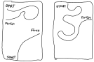
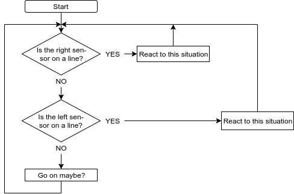

# Session 3 Workbook - Physical Computing

    

# What awaits you today

Hello and welcome back to the fourth session of the Physical Computing theme! This session will take the form of a coding and driving challenge for your robots.

Please re-group into the teams from last time.

Today's aim is to turn your robot into a fully functioning line follower - something akin to the following:

You will now complete the missing line sensor(s) on your robot, wire them up, write a program to use two line sensors instead of one, and test your contraption on our very own test tracks!

    
    <figcaption align="center">A sample test track</figcaption>

# A word about the write-up

As we told you during the Introductory Session, you will be expected to write up this work in a successes and failures document.

So throughout this session, you should think about what you want to include in there --

* You only have tonight to take pictures of the robot
* Exchange contact details with your team mates in case you need to check back over anything after the class
* The deadline for submitting the documents is **6 November 2017**. Please note that you will not pass this course if you fail to submit this write-up.

# Exercises

1. Install the second line sensor on your robot and complete the electronic setup. Based on [the code we used during the last session](https://github.com/till-h/ICAHHorizons_Y2PhysComp/blob/master/session%202/Session%202%20Workbook%20-%20Physical%20Computing.md#exercises), write a test program to ensure both sensors work as intended. You can use the tracks or some spare black tape for this.

1. Before you get lost in writing the code to control the robot, think about the high-level design. What are you trying to achieve? What should happen when one of the sensors "sees" the black line? How fast can you drive your robot around the parcours before overshooting the line becomes an issue and it misses it altogether at the slightest bend? Maybe the following diagram helps.

   

    
    <figcaption align="center">An (incomplete) flowchart for using two line sensors</figcaption>
   

1. Can you re-enable the distance sensor and stop the robot when an obstacle is put in its way? Can you get the robot to resume its line following when the obstacle is removed?

1. And how about a gentle slow-down as the obstacle comes nearer? (Rather than abruptly stopping when it gets closer than some cut-off?)

1. Finally, we may just have a special decoding challenge waiting for you at the end of the track! Speak to one of us to start working on this.